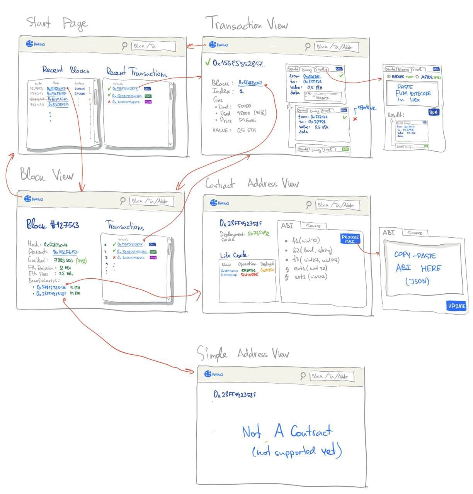

# ETHDenver2021 PARSIQ Starter Pack

Here at PARSIQ we proved that time travel is possible!

Now we want to make time traveling available for every blockchain developer. Today we’re building tools that allow not only to time travel within the Ethereum blockchain but pause the time flow and explore the alternative realities. We invite hackers and buidlers to join us in this exciting yet challenging adventure and build something awesome together. 

Every time traveller needs a robust toolchain. Here is your time traveler starter pack.

* First and foremost you need a time travel machine. This is an instrumented Ethereum blockchain archive node, which is packed and ready for long trips in time. There are several unique JSON-RPC Requests at your disposal which give you tons of information about the past, present and future.

* You can get concise yet detailed block traces, which provide structured information about all the state changes within any transaction at any point in time. We believe that at PARSIQ we found an optimal amount of information that allows us to answer various questions about any intermediate state and even perform a What-If analysis. 

* You will be able to inject your own EVM bytecode to any transaction at the specific point in time and receive results of the execution. The point in time defined by the gas amount consumed up-to specific opcode.

* You can observe smart contracts throughout their lifecycle and inspect the history of CREATE/CREATE2/SELFDESTRUCT with code and code hashes.

It’s easy to get lost in time and labirints of alternative realities, therefore you need a map and compass. These are our examples. We have prepared several examples which demonstrate how to request data from our node, how to get transaction trace, inject custom bytecode etc. Hopefully this will make your time traveler life easier!

### Installation: `npm i`
### API methods

* `debug_transferTrace` - our famous block traces. Example: [debug_transferTrace.js](debug_transferTrace.js). 
* `debug_injectCallBulk` - inject custom EVM byte code to transaction. Example: [debug_injectCallBulk.js](debug_injectCallBulk.js)
* `eth_parsiqContractInfoByAddress` - get contract details by address. Example: [eth_parsiqContractInfoByAddress.js](eth_parsiqContractInfoByAddress.js)
* `eth_parsiqContractDataByHash.js` - get contract data by hash. Example: [eth_parsiqContractDataByHash.js](eth_parsiqContractDataByHash.js)

Our magical instrumented node is located at https://ethdenver-parsiq.net:2096/ and will be available open source as an instrumentation of `geth`.

Please, take a look at our [async-generator based code](https://www.npmjs.com/package/@parsiq/block-tracer) for traversing traces produced by `debug_transferTrace`. It will give you a lot of information about our data model of block traces. Start from `BlockTrace` type definition in [our strongly typed library](https://github.com/parsiq/block-tracer/blob/master/src/lib/block-trace.type.ts#L94)

## Find your team and buidl together!

Although time traveling is fun, doing it without a purpose might be a waste of time. 

What could be more fun than time traveling? Right! Time traveling with ___bounty hunting!___
We have prepared some challenges for our ETHDenver2021 buidlers! 

### Bounty 1:  Advanced Block Explorer
#### Prize: 2000 usd

We encourage you to create a data rich Ethereum block explorer leveraging PARSIQ Ethereum node API. It should be able to present and explore various data provided by our API, for example hierarchical traces of all transactions in a block together with their time-codes in terms of gas.

We expect the team to build a complete Web Application (backend and frontend) that potentially could evolve into a real public block explorer with transaction debugging functionality enabled by PARSIQ features.

#### Desired properties of the solution:
* ___Wholesomeness___. Ability to demonstrate all features available in our block-traces in an intuitive and/or creative way.
* ___Resource friendliness___. For example by caching API responses when possible.
* ___Interoperability___. Being ready to integrate with expression debugger from Bounty 2.
* ___Future proofness___. Being ready to evolve into a public block explorer.

> Hint: use `debug_transferTrace`, `eth_parsiqContractInfoByAddress` on CREATE/CREATE2/SELFDESTRUCT and `eth_parsiqContractDataByHash` if you want to retrive actual EVM bytecode by it's hash (if needed).

### Bounty 2:  Solidity Expression Evaluator (What-If Analysis). 
#### Prize: 2000 usd

We encourage you to create a tool for “What-If” analysis that will work within all the history of Ethereum Mainnet. Leveraging the PARSIQ Ethereum node API you will be able to specify a block hash, a transaction index, a gas amount spent from the beginning of the transaction, and your custom EVM bytecode you want to execute. You can even fine tune the available gas amount to be able to execute your logic. The API will return a trace of your injected EVM bytecode in the very same format our block tracer is built upon. Should you inject any calls, logs, or other opcodes their traces will be returned to you for further analysis.

This functionality is similar to “break point/eval expression” features offered by traditional IDEs.

We expect the team to develop a visual solution that will allow users to define and inject code to perform What-If analysis. The user must be able to write instructions in more developer-friendly language, other than EVM bytecode. For example, it can be Solidity or some subset of Solidity or a custom Solidity-like language.

> Hey! It is simpler than you probably think! Just take a look how to return a value from a transaction, or take a balance of any account at given opcode: [debug_injectCallBulk.js](debug_injectCallBulk.js). If you can encode ABI calls you are probably on a half way to the bounty. Yet we expect something creative

We expect the solution to allow a user to express arbitrary smart contract function call with given parameters. This might be achieved by providing a target smart contract ABI. To illustrate this functionality, imagine you can take an arbitrary transaction and inject the custom code which calls the Uniswap contract to get an exchange rate for a specific pair. In other words you will be able to take any transaction and answer a question like “What was the PRQ-ETH pair exchange rate on Uniswap when this opcode is executed?”

#### Desired properties of the solution:
* ___Completeness___. Ability to give users a tool for what-if analysis in an intuitive (at least for tech savvy programmers) and creative way.
* ___Interoperability___. Being ready to integrate with the Block Explorer from Bounty A
* ___Future proofness___. Being ready to evolve and extend the functionality.
      
### Bounty 3: Creative ParsiQL Scripts. 
#### Prize: 1st 500 usd; 2nd 350 usd; 3rd 150 usd

We encourage you to try our domain specific language ParsiQL to process blockchain events in real time and build amazing notifications and automations.
Our language is highly inspired by LINQ (by Anders Hejlsberg). Although ParsiQL is at a very early stage of development it is more flexible in terms of integrations and data-sources. 

It allows you to augment blockchain data with the data from external sources such as  market data or transaction risk scoring data (in commercial versions - available to try at buidlathon time upon request). Moreover, you can maintain a state within your stream definitions, which allows you to analyse asset flows, turnovers, trading pressures etc. Imaging all of that being performed in real time on the superposition of all valid branches of a blockchain.
You can find a number of useful examples that can aid mastering ParsiQL at https://docs.parsiq.net/parsiql/code-samples

#### Criteria:
* We don’t put any specific criteria on what to do in this category. The only criteria is creativity and ability to demonstrate real automations built on top of our API.

# Take your time and choose wisely. Happy hacking! 

